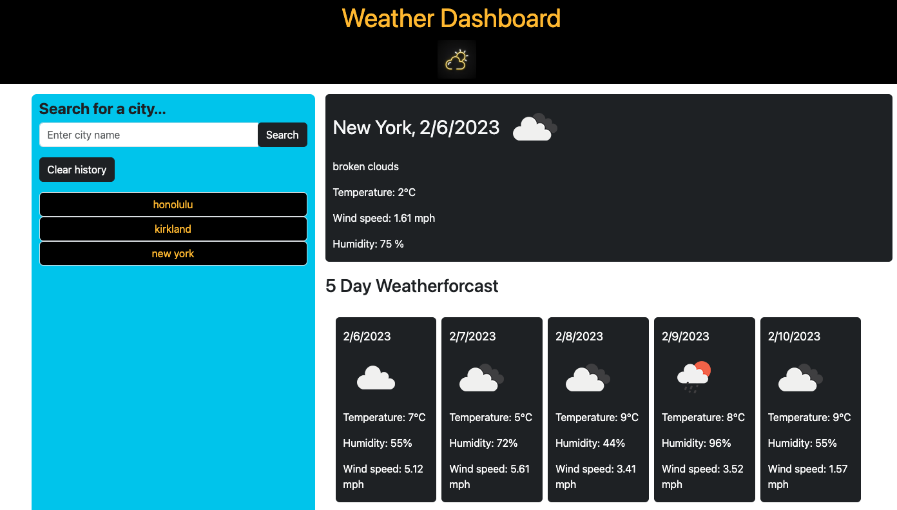

# 5-day-weather-forecast
This is a web application that utilizes Javascript and OpenWeatherMap APIs to help users retrieve and store weather information for a given city.

## Description

This application was developed using HTML, CSS, Javascript and various third-party APIs as part of a class assignment. This application is for personal use only

## Getting Started

### Dependencies

* Modern web browser that supports HTML5 and updated Javascript.(ex. Google Chrome, Modzilla Firefox, etc.)

### Installing

* No additional installation is required if a web browser is already installed

### Executing program

* Open the web application through the following link: https://lingeorge88.github.io/5-day-weather-forecast/
* Execute the program by entering a city in the search field and clicking on the "search" button

## Help

* After clicking the search button, the web page will store the last user input below the "Clear History" button
* Clicking the "Clear History" button will remove previous searches and clear the local storage
* Repeat searches will only be stored once
* Due to technical limitations the weather information displayed will be from the first search result from the OpenWeatherMap API
* If previous searches exist, upon refreshing the page the user will be able to see the weather information from their last search before existing the program. 

## Authors

Contributors names and contact info

George Lin  
Github: https://github.com/lingeorge88

## Version History

* 0.1
    * Initial Release

## License
N/A

## Acknowledgments
* Bootstrap API: https://getbootstrap.com/docs/5.3/getting-started/introduction/
* OpenWeatherMap API: https://openweathermap.org/guide
